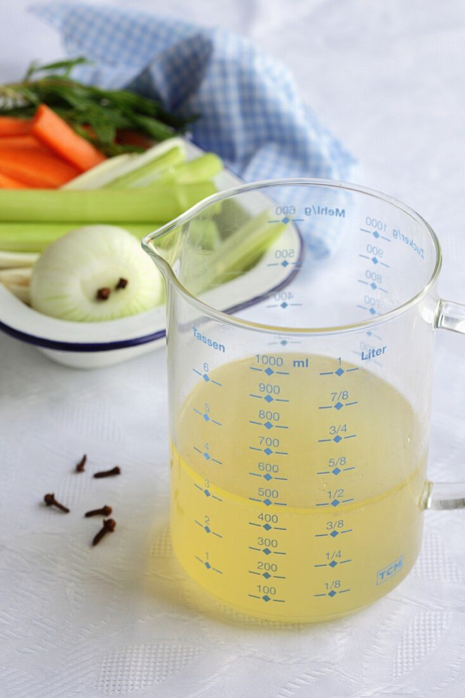

# What is Bayesian statistical inference?
## Introduction

### Today's topics

1. What is Bayesian statistical inference?
2. Why is it useful in general?
3. Why is it useful in systems biology?
4. The big challenge

### Computer goals

Set up git/ssh, python, cmdstanpy and cmdstan

## What is Bayesian statistical inference?

### Probability function
:::: {.columns align=top totalwidth=8em}
::: {.column width="60%"}
A function that can measure the water in a jug.

i.e. $p: S \rightarrow [0,1]$ where:

- $p(S) = 1$
- For disjoint $A, B \in S$ $p(A\cup B) = p(A) + p(B)$

:::

::: {.column width="40%"}

:::

:::: 

### Statistical Inference
:::: {.columns align=top totalwidth=8em}
::: {.column width="60%"}

In: facts about a ~~spoonful~~ sample

Out: propositions about a ~~soup~~ population

e.g.

- spoonful not salty $\rightarrow$ soup not salty
- no carrots in spoon $\rightarrow$ no carrots in soup

:::

::: {.column width="40%"}
](img/soup.jpg)
:::

:::: 

### Bayesian statistical inference

:::: {.columns align=top totalwidth=8em}
::: {.column width="60%"}

Statistical inference resulting in a probability.

e.g.

- spoon $\rightarrow$ $p(\text{soup not salty})$ = 99.9%
- spoon $\rightarrow$ $p(\text{no carrots in soup})$ = 95.1% 

Non-Bayesian inferences:

- spoon $\rightarrow$ Best estimate of [salt] is 0.1mol/l
- $p_{null}(\text{spoon})$ = 4.9% $\rightarrow$ no carrots (p=0.049)

:::

::: {.column width="30%"}

{height=300 fig-align=right}

:::

::::

# Why is Bayesian statistical inference useful in general?

### The philosophical reason

:::: {.columns align=top totalwidth=8em}
::: {.column width="60%"}

Bayesian inference can be interpreted in terms of information and plausible
reasoning.

e.g. "According to the model..."

* "...x is highly plausible."
* "...x is more plausible than y."
* "...the data doesn't contain enough information for firm conclusions about x."

:::

::: {.column width="40%"}

{height=80% fig-align=right}

:::

::::

### Mathematical reason
:::: {.columns align=top totalwidth=8em}
::: {.column width="60%"}

Bayesian inference is old!

This means

* it is well understood mathematically.
* conceptual surprises are relatively rare.
* there are many compatible frameworks.

:::

::: {.column width="40%"}

](img/laplace.jpg){height=80%}

:::

::::

### General practical reason

Probabilities decompose nicely:

$$
p(\theta, y) = p(\theta)p(y\mid\hat{y}(\theta))
$$

- $p(\theta)$: nice form for *background* information, e.g. anything non-experimental
- $\hat{y}(\theta)$: nice form for *structural* information, e.g. physical laws
- $p(y\mid\hat{y}(\theta))$: nice form for *measurement* information, e.g. instrument accuracy

## Why is Bayesian inference useful in systems biology?

### Regression models: good for describing measurements

Idea: measured value systematically but noisily depends on the true value e.g.

$y \sim N(\hat{y}, \sigma)$

Bayesian inference lends itself to regression models that accurately describe
details of the measurement process. e.g.

- heteroskedasticity $y \sim N(\hat{y}, \sigma(\hat{y}))$
- non-negativity $y \sim LN(\ln{\hat{y}}, \sigma)$ (also compositionality)
- unknown bias $y \sim N(\hat{y} + q, \sigma)$

### Multi-level models: good for describing sources of variation

:::: {.columns align=top totalwidth=8em}
::: {.column width="40%"}

Measurement model:

$y \sim binomial(K, logit(ability))$

Gpareto model:

$ability \sim GPareto(m, k, s)$

Normal model:

$ability \sim N(\mu, \tau)$

:::

::: {.column width="60%"}

:::

::::

### Generative models: good for representing structural information

:::: {.columns align=top totalwidth=8em}
::: {.column width="60%"}

Information about hares ($u$) and lynxes ($v$):

\begin{align*}
\frac{d}{dt}u &= (\alpha - \beta v)u \\
\frac{d}{dt}v &= (-\gamma + \delta u)v
\end{align*}

i.e. a deterministic function turning $\alpha$, $\beta$, $\gamma$, $\delta$,
$u(0)$ and $v(0)$ into $u(t)$ and $v(t)$.

:::

::: {.column width="40%"}
](img/lv.png)
:::

::::

## The big challenge
### The big challenge

$p(\theta \mid y)$ is easy to evaluate but hard to integrate.

This is bad as we typically want something like

$$
p([salt] < 0.1, spoon=s)
$$

which is equivalent to

$$
\int_{0}^{0.1}p([salt], spoon=s)d[salt]
$$

$p(\theta \mid y)$ has one dimension per model parameter.

### The solution: MCMC

:::: {.columns align=top totalwidth=8em}
::: {.column width="60%"}


Strategy:

1. Find a series of numbers that 
   * quickly finds the high-probabiliy region in parameter space
   * reliably matches its statistical properties
   
2. Do sample-based approximate integration.

It (often) works!

We can tell when it doesn't work!

:::

::: {.column width="40%"}
](img/mcmc.png): 
:::

::::

## Homework 

### Things to read

@boxBayesianInferenceStatistical1992 Ch. 1.1 (available from dtu findit) gives a
nice explanation of statistical inference in general and why Bayes.

Historical interest:

- @laplaceMemoirProbabilityCauses1986 and @stiglerLaplace1774Memoir1986 
- @jaynesProbabilityTheoryLogic2003 Preface

### Things to set up

#### Python

First get a recent (ideally 3.10+) version of Python This can be very annoying so talk to me if necessary!

Next get used to Python virtual environments. 

The method I like is to put the virtual environment in a folder `.venv` inside the root of my project:

```shell
$ python -m venv .venv --prompt=bssb
```

Then to use:  [Tip: use an ergonomic alias to activate venvs e.g. `alias va="source .venv/bin/activate"`]{.aside}

```shell
$ source .venv/bin/activate
# ... do work
$ deactivate
```


#### Git and ssh
\tiny
```shell
git clone git@github.com:teddygroves/bayesian_statistics_for_systems_biologists.git
```

#### Cmdstanpy and cmdstan

```python
from cmdstanpy import CmdStanModel
filename = "example_stan_program.stan" 
code = "data {} parameters {real t;} model {t ~ std_normal();}"
with open(filename, "w") as f:
    f.write(code)
model = CmdStanModel(stan_file=filename)
mcmc = model.sample()
```

# Next time
#### Theory

Hamiltonian Monte Carlo:

- what?
- why?

MCMC diagnostics

#### Computer

Stan, cmdstanpy, arviz:

- formats
- workflow
- write a model

