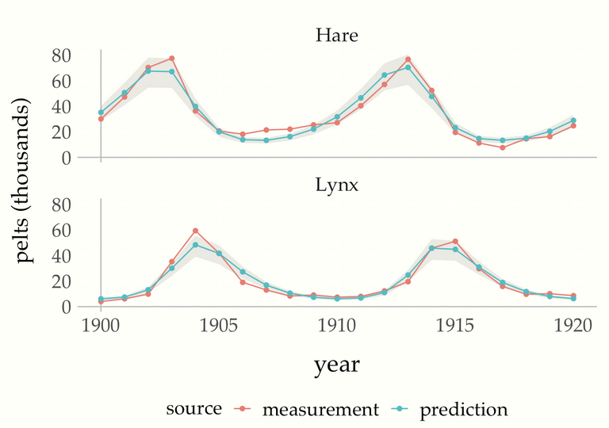
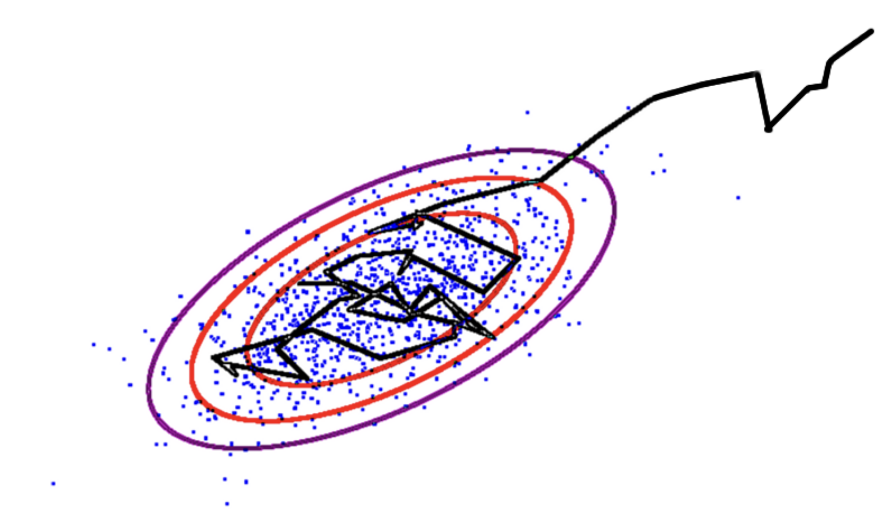

# Introduction to Bayesian inference
## Introduction

### Today's topics

1. [What is Bayesian statistical inference?](#what-is-bayesian-statistical-inference)
2. [Why is it useful?](#why-is-bayesian-statistical-inference-useful)
3. [The big challenge](#the-big-challenge)

### Computer goals

Set up git/ssh, Python, cmdstanpy and cmdstan

# What is Bayesian statistical inference?

## Probability function
:::{#fig-jug}


A jug of water
:::

A function that can measure the water in a jug.

i.e.

$p: S \rightarrow [0,1]$ where

- $S$ is an [event space](https://en.wikipedia.org/wiki/Event_(probability_theory)#Events_in_probability_spaces) 
- If $A, B \in S$ are disjoint, then $p(A\cup B) = p(A) + p(B)$

## Bayesian epistemology

Probability functions can describe belief, e.g.

::::{.columns}

:::{.column}

"Definitely B":

{width=35%}

:::

:::{.column}

"Not sure if A or B":

{width=35%}

:::

:::{.column}

"B a bit more plausible than A":

{width=35%}

:::

::::

## Statistical Inference

::: {#fig-soup}


A nice soup: [here is the recipe](https://www.theguardian.com/lifeandstyle/2017/jan/24/20-best-one-pot-recipes-part-2-tom-kerridge-nigella-lawson-broths-hangover-food)

:::

In: facts about a ~~spoonful~~ sample

Out: propositions about a ~~soup~~ population

e.g.

- spoonful not salty $\rightarrow$ soup not salty
- no carrots in spoon $\rightarrow$ no carrots in soup


## Bayesian statistical inference
:::{#fig-soup-jug}

{width=50%}

A jug of soup

:::

Statistical inference resulting in a probability.

e.g.

- spoon $\rightarrow$ $p(\text{soup not salty})$ = 99.9%
- spoon $\rightarrow$ $p(\text{no carrots in soup})$ = 95.1% 

Non-Bayesian inferences:

- spoon $\rightarrow$ Best estimate of [salt] is 0.1mol/l
- $p_{null}(\text{spoon})$ = 4.9% $\rightarrow$ no carrots (p=0.049)


# Why is Bayesian statistical inference useful?

## General reasons

### Easy to interpret

::: {#fig-jaynes width="40%"}

[{height=80%}](https://readyforai.com/download/probability-theory-the-logic-of-science-pdf/)

It's a good book!

:::

Bayesian inference produces probabilities, which can be interpreted in terms of
information and plausible reasoning.

e.g. "According to the model..."

* "...x is highly plausible."
* "...x is more plausible than y."
* "...the data doesn't contain enough information for firm conclusions about x."


### Old
::: {#fig-laplace width="40%"}

[](https://en.wikipedia.org/wiki/Pierre-Simon_Laplace){height=80%}

Laplace, who did Bayesian inference in the 1780s
:::


Bayesian inference is old!

This means

* it is well understood mathematically.
* conceptual surprises are relatively rare.
* there are many compatible frameworks.

### An easy way to represent your information

Probabilities decompose nicely:

$$
p(\theta, y) = p(\theta)p(y\mid\hat{y}(\theta))
$$

- $p(\theta)$: nice form for *background* information, e.g. anything non-experimental
- $\hat{y}(\theta)$: nice form for *structural* information, e.g. physical laws
- $p(y\mid\hat{y}(\theta))$: nice form for *measurement* information, e.g. instrument accuracy

## Reasons specific to computational biology

### Regression models: good for describing measurements

Regression: measured value noisily depends on the true value e.g. $y \sim N(\hat{y}, \sigma)$.

Biology experiments often have measurement processes with awkward features. e.g.

- heteroskedasticity (amount of noise depends on measured value)
- constraints (e.g. non-negativity, compositionality)
- unknown latent bias (e.g. the pump is supposed to add $0.05cm^3$ per min, but does it?) 

Bayesian inference is good at describing these.

### Multi-level models: good for describing sources of variation

::: {#fig-baseball}


plot from <https://github.com/teddygroves/baseball>
:::

Measurement model:

$y \sim binomial(K, logit(ability))$

Gpareto model:

$ability \sim GPareto(m, k, s)$

Normal model:

$ability \sim N(\mu, \tau)$


### Generative models: good for representing structural information

::: {#fig-lotka-volterra}


From a [Stan case study](https://mc-stan.org/users/documentation/case-studies/lotka-volterra-predator-prey.html)
:::

Information about hares ($u$) and lynxes ($v$):

\begin{align*}
\frac{d}{dt}u &= (\alpha - \beta v)u \\
\frac{d}{dt}v &= (-\gamma + \delta u)v
\end{align*}

i.e. a deterministic function turning $\alpha$, $\beta$, $\gamma$, $\delta$,
$u(0)$ and $v(0)$ into $u(t)$ and $v(t)$.

# The big challenge

$p(\theta \mid y)$ is easy to evaluate but hard to integrate.

This is bad as we typically want something like

$$
p([salt] < 0.1, spoon=s)
$$

which is equivalent to

$$
\int_{0}^{0.1}p([salt], spoon=s)d[salt]
$$

$p(\theta \mid y)$ has one dimension per model parameter.

## The solution: MCMC

::: {#fig-mcmc}
: 

An image I found [online](http://mlg.eng.cam.ac.uk/tutorials/06/im.pdf)
:::


Strategy:

1. Find a series of numbers that 
   * quickly finds the high-probabiliy region in parameter space
   * reliably matches its statistical properties
   
2. Do sample-based approximate integration.

It (often) works!

We can tell when it doesn't work!

# Homework 

## Things to read

@boxBayesianInferenceStatistical1992 [Ch. 1.1] (available from dtu findit) gives a
nice explanation of statistical inference in general and why Bayes.

Historical interest:

- @laplaceMemoirProbabilityCauses1986 and @stiglerLaplace1774Memoir1986 
- @jaynesProbabilityTheoryLogic2003 Preface

## Things to set up

### Python

First get a recent (ideally 3.11+) version of Python This can be very annoying so talk to me if necessary!

Next get used to Python virtual environments. 

The method I like is to put the virtual environment in a folder `.venv` inside the root of my project:

```shell
$ python -m venv .venv --prompt=bscb
```

Then to use:  [Tip: use an ergonomic alias to activate venvs e.g. `alias va="source .venv/bin/activate"`]{.aside}

```shell
$ source .venv/bin/activate
# ... do work
$ deactivate
```

### Git and ssh

```shell
git clone git@github.com:teddygroves/bayesian_statistics_for_systems_biologists.git
```

### Cmdstanpy and cmdstan

First install them:

```shell
$ pip install cmdstanpy
$ python -m cmdstanpy.instsall_cmdstan
```

Now test if they work

```python
from cmdstanpy import CmdStanModel
filename = "example_stan_program.stan" 
code = "data {} parameters {real t;} model {t ~ std_normal();}"
with open(filename, "w") as f:
    f.write(code)
model = CmdStanModel(stan_file=filename)
mcmc = model.sample()
```

# Next time
## Theory

Hamiltonian Monte Carlo:

- what?
- why?

MCMC diagnostics

## Computer

Stan, cmdstanpy, arviz:

- formats
- workflow
- write a model

# References {.unnumbered}

::: {#refs}
:::
