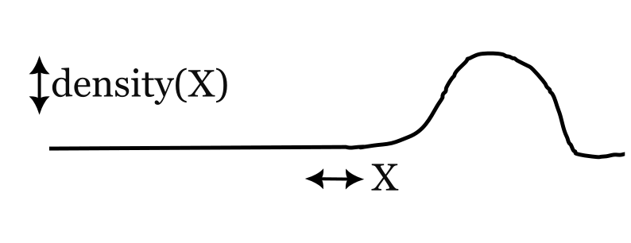
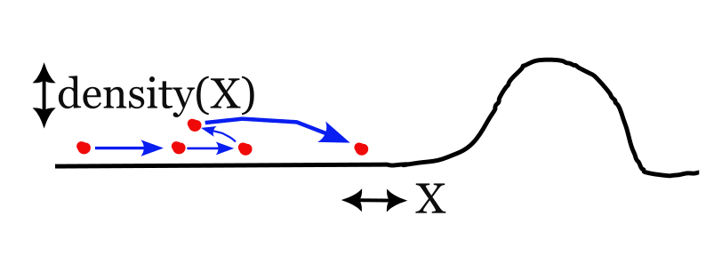
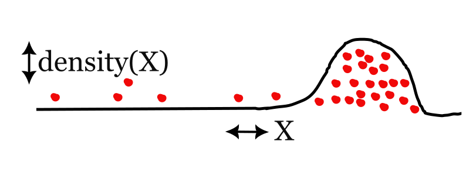
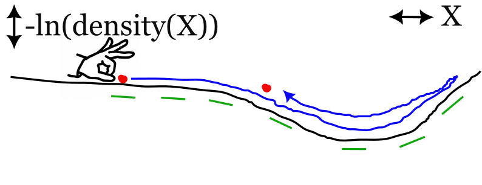

# MCMC and Stan
## Introduction

Welcome back!

Plan for today:

1. [MCMC](#mcmc)
2. [Getting started with Stan in Python](#getting-started-with-stan-in-python)

## MCMC

### The big picture

**In** 
A rule for evaluating the target function and maybe its gradients

**Out**: A [**M**arkov **C**hain](https://en.wikipedia.org/wiki/Markov_chain) of numbers that you can do [**M**onte **C**arlo](https://en.wikipedia.org/wiki/Monte_Carlo_integration) integration with.

### Simple case

#### Problem



One random variable $X$ with probability density function $density$.

Aka a "one-dimensional parameter space".

Evaluating $density(x)$ for a given value $x$ (aka "point in parameter space") is easy.

Calculating the area under a region of the $density$ curve (aka "the probability mass") is expensive.

This is annoying, we need to know that!

#### Solution

Generate a series $x_1, ..., x_i,..., x_n$ where every number depends on the previous
number(s), i.e. a [Markov chain](https://en.wikipedia.org/wiki/Markov_chain).

To calculate $x_{i+1}$, generate a random number and take into account
$density(x_i)$. ^[This is the interesting and tricky bit!]



If this works, with a long enough series of numbers we get something like this:



:::{.callout-important}

### Success condition for MCMC

The numbers from the Markov chain have to approximately agree with the target
density function, i.e. in any region the number of dots is approximately
proportional to the area under the curve.

:::

Now we can do [Monte Carlo integration](https://en.wikipedia.org/wiki/
Monte_Carlo_integration), i.e. approximate the area under a region of curve by
counting the red dots in that region.

### Metropolis Hastings

The first (I think?) MCMC algorithm. Original paper: @metropolisEquationStateCalculations1953.^[Metropolis was first author but didn't do any work! That was [Arianna Rosenbluth](https://en.wikipedia.org/wiki/Arianna_W._Rosenbluth) (programming) plus [Marshall Rosenbluth](https://en.wikipedia.org/wiki/Marshall_Rosenbluth) & [Edward Teller](https://en.wikipedia.org/wiki/Edward_Teller) (maths)]

Generates Markov chains that provably agree with arbitrary target density functions (in the asymptotic limit).

Roughly how it works:

1. Choose candidate by randomly perturbing previous point $x_i$
2. Accept or reject candidate randomly according to the ratio $\frac{density(candidate)}{density(x_i)}$
3. $x_{i+1}$ is candidate if accept else x_i

[Visualisation](http://chi-feng.github.io/mcmc-demo/app.html?algorithm=RandomWalkMH&target=banana)

Doesn't work for more than ~10 dimensional parameter spaces.

### Hamiltonian Monte Carlo

Big picture: MCMC that works for large parameter spaces.

Key innovation: travel through parameter space quickly using gradients. 

Illustration:



[A better illustration](http://chi-feng.github.io/mcmc-demo/app.html?algorithm=HamiltonianMC&target=banana)


:::{.callout-note}
### A small but important detail:

To decide how hard to flick the ball and how precisely to calculate its trajectory for a particular case, **adaptation** is required, i.e. running the algorithm in warm-up mode for a bit and learning by trial and error. How best to do adaptation is an important open question.

:::

Limitations: 

- No discrete parameters
- Performs badly when the target (log-scale) density function is wiggly.

#### Reading

@betancourtConceptualIntroductionHamiltonian2018

@betancourtConvergenceMarkovChain2018

@beskosOptimalTuningHybrid2010

@andrieuIntroductionMCMCMachine

## Stan

Stan is:

- A [language](https://mc-stan.org/docs/reference-manual/index.html) for specifying probability density functions as Stan programs.

- A [compiler](https://github.com/stan-dev/stanc3/) that turns Stan programs into instructions for inference engines.

- An [inference engine](https://github.com/stan-dev/stan) implementing adaptive HMC and some other algorithms.

- A [library](https://github.com/stan-dev/math) of functions for calculating the gradients of interesting probability density functions.

- Some interfaces for popular computer tools:

  - Command line: [cmdstan](https://mc-stan.org/docs/cmdstan-guide/index.html)
  - Python:
    - [cmdstanpy](https://cmdstanpy.readthedocs.io)
    - [pystan](https://pystan.readthedocs.io/en/latest/)
  - R:
    - [cmdstanr](https://mc-stan.org/cmdstanr/)
    - [Rstan](https://mc-stan.org/users/interfaces/rstan)

### Why use Stan?

Alternatives: [pymc](https://www.pymc.io/welcome.html), [blackjax](https://blackjax-devs.github.io/blackjax/), [Turing.jl](https://turinglang.org/stable/) [tensorflow probability](https://www.tensorflow.org/probability)

Overview as of 2023: @strumbeljPresentFutureSoftware.

Why I like Stan:

- Big, active and knowledgeable community (most important reason)

- Featureful (complex numbers, fast solvers, up-to-date diagnostics)

- Fast (for CPU-bound, general purpose adaptive HMC)

## Getting started with Stan in Python

Install cmdstanpy

```sh
pip install cmdstanpy
```

Use cmdstanpy to install the rest of Stan

```sh
python -m cmdstanpy.install_cmdstan --cores 2
```

I like to store Stan outputs using the library arviz. It also makes nice plots.

```sh
pip install arviz

```

### Write a Stan program

A Stan program consists of function definitions, variable declarations and
statements, organised into `{...}` delimited blocks, e.g.

```stan
data {
  real y;  # a variable declaration
}
model {
  y ~ normal(0, 1.4);  # a statement
}
```

The purpose of a Stan program is to define the probability density for any
combination of data and parameters.

It is ok for there to be no parameters:

```stan
transformed data {
  real y = 2;  # this is both a statement and a declaration!
}
model {
  y ~ normal(0, 1.4);  # the total density is N(2 | 0, 1.4) = 0.103
}
```

or no data:

```stan
parameters {
  real alpha;
}
model {
  alpha ~ normal(0, 1.4);  # Stan can find the density for any alpha
}
```

### Cmdstanpy workflow

#### Step 1

Use standard Python tools to make a dictionary mapping data variables to inputs e.g.

```python
my_stan_input = {"y": 2}
```

(Optional) Save the input as a json file:

```python
import json
with open("my_stan_input.json", "w") as f:
    json.dump(my_stan_input, f)
```

#### Step 2

Instantiate a `CmdstanModel`

```python
from cmdstanpy import CmdStanModel
my_model = CmdStanModel(stan_file="my_stan_program.stan")
```

Cmdstanpy will use Stan's compiler to create `.hpp` and executable files.

#### Step 3

Use the method `CmdStanModel.sample` to trigger adaptive HMC.

```python
my_mcmc_results = my_model.sample(data=my_stan_input)
```

#### Step 4

Use the methods `CmdStanMCMC.diagnose` and `CmdStanMCMC.summary` for quick diagnostics.

```python
summary = my_mcmc_results.summary()
diagnostics = my_mcmc_results.diagnose()
```

#### Step 5

Convert to arviz `InferenceData` and save

```python
import arviz
my_idata = arviz.from_cmdstanpy(my_mcmc_results)
my_idata.to_json("my_arviz_idata.json")
```

### Stan references

[Cmdstanpy docs](https://cmdstanpy.readthedocs.io/en/v1.1.0/)

[Stan reference manual](https://mc-stan.org/docs/reference-manual/index.html)

[Stan functions reference](https://mc-stan.org/docs/functions-reference/index.html)

[Stan User's guide](https://mc-stan.org/docs/stan-users-guide/index.html)

[stan-dev github organisation](https://github.com/stan-dev/)


# Next time / homework

- How to Program your own mcmc!

- I ran MCMC, now what??

# References {.unnumbered}

::: {#refs}
:::

