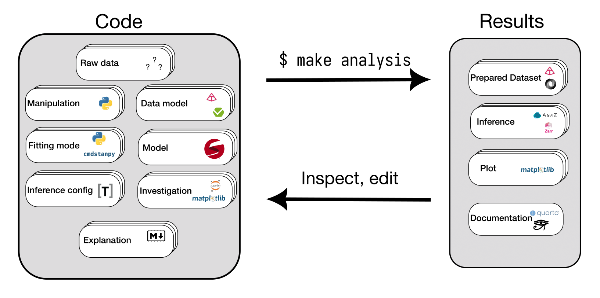

# Bayesian workflow

Arguably the hardest thing about Bayesian statistical modelling, especially in the context of biology, is orchestrating all the software, computation and human investigation involved. That's what we're going to look at today!

## Reading

@gelmanBayesianWorkflow2020

## Tasks in a statistical analysis
* Get raw data(s)
* Get prepared data(s)
* Implement statistical model(s)
* Interface between prepared data(s) and model(s)
* Specify and perform inference(s) 
* Investigate data(s) and inference(s)
* Document what was done

## Goals

Ideally a statistical investigation should be

- Collaborable
- Reproducible
- Flexible
- Documented
 
In order for it to be easy for others to collaborate on an analysis, the software implementing it should be high-quality, use popular languages/libraries/frameworks and work well with affordances like tests, CI, common lint rules, version control etc.

The analysis is reproducible if it is easy for another researcher to obtain the key results for themselves. There are many ways of making an analysis more reproducible, but in my opinion the biggest win is having a **single entry point**, i.e. a command that someone can run and replicate the whole analysis from start to finish.

Statistical analyses are open-ended: it is very rare that the final model and data are the same ones that the were envisaged at the start. Because of this it is important for statistical analysis projects to be flexible and not rule out too many possible developments in advance.

Finally, statistical analysis projects require high quality documentation. It is really important to write down what decisions were made at what points and to make it easy for both collaborators and interested readers to understand what was done. 

## Strategies

Collaborability:

- Use a sensible, standardised file structure (more about this later!)
- Try and work with other people!
- Helpful tooling for collaborative Python projects:
  - [ruff](https://docs.astral.sh/ruff/)
  - [black](https://github.com/psf/black)
  - [pre-commit](https://pre-commit.com)
- Follow [GitHub flow](https://docs.github.com/en/get-started/using-github/github-flow#)

Reproducibility:

- Use an automation tool (e.g. [make](https://www.gnu.org/software/make/), [just](https://github.com/casey/just) or your own shell script) to orchestrate your analysis.
- Fix the random seed where appropriate.
- Run your analysis on multiple computers.

Flexibility

Don't assume that...

- ...there is just one of anything (raw dataset, processed dataset, data transformation, statistical model, analysis, ...)
- ...any dataset can/should be represented by a single table.
- ...any model belongs to a particular family.

Documentation

- Use a standard documentation tool
- Couple documentation with the rest of the analysis 
  - read from the main plots folder
  - include code directly rather than copy/paste

## Is there an easy way to follow these strategies?


Yes! I wrote a project template called [bibat](https://bibat.readthedocs.io/en/latest/) that does this. Bibat stands for "Batteries-Included Bayesian Analysis Template". Here's how to use it.

First install [copier](https://copier.readthedocs.io/en/stable/):^[[pipx](https://pipx.pypa.io/stable/) is a handy tool for installing python applications that stops them interfering with each other]

```sh
$ pipx install copier
```

Now choose a name for the folder where you want to store your project and run 

```sh
$ copier copy gh:teddygroves/bibat my_chosen_folder_name
```

You will be asked some questions about your project, and then your chosen folder will be filled up with files based on your answers.

Alternative method for [pdm](https://pdm-project.org/en/latest/) enjoyers: 

```sh
$ mkdir my_chosen_folder_name
$ cd my_chosen_folder_name
$ pdm init --copier gh:pawamoy/copier-pdm --UNSAFE
```

This image shows how a bibat project works:



The idea:

1. Edit the files on the left
2. Run `make analysis`, generating the files on the right 
3. Look at the files
4. Repeat

Bibat has "batteries included" because it works immediately. If you run `make analysis` from a new project's root an example analysis will run: at this point you are already in the main loop.

For an example of how you can implement a whole analysis with bibat, see [here](https://bibat.readthedocs.io/en/latest/_static/report.html)

If you have any thoughts about bibat, please let me know!

## Bibat demo

Now Teddy will demonstrate how to implement an analysis using bibat.

## References
